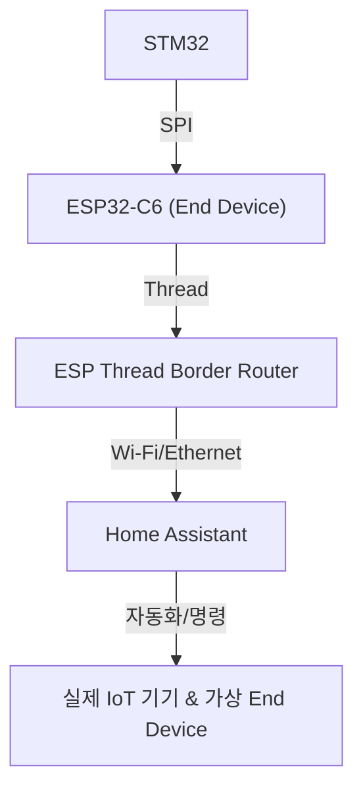

## 1. **기계(하드웨어/네트워크) 구조**

### **주요 컴포넌트**

1. **STM32H743VIT6 (마스터)** (미완료)
    - 센서 데이터 수집(예: 카메라, 마이크 등)
    - 딥러닝 모델로 “사람이 일어났는지/안 일어났는지” 판별
    - 음성 명령(“5분만 더!”) 인식
    - 이벤트/상태를 SPI로 전송
2. **ESP32-C6 (Slave)** (미완료)
    - STM32와 SPI로 연결
    - STM32로부터 받은 이벤트/명령을 Thread 메시지로 변환
    - Thread 네트워크의 엔드디바이스 역할
3. **ESP Thread Border Router** (완료)
    - ESP32-S3 + ESP32-H2 조합 (공식 ESP Thread Border Router)
    - Thread 네트워크와 IP 네트워크(Wi-Fi/Ethernet) 브릿지
    - Home Assistant와 연동
4. **Home Assistant** (완료)
    - Thread Border Router와 연동
    - IoT 기기 상태/이벤트 수집 및 자동화 제어
    - 사용자 앱/웹 대시보드 제공
5. **실제 IoT 기기** (미완료)
    - 실제 Thread 기반 조명, 플러그, 에어컨 등 (2개 내외)
6. **가상 Thread End Device (시뮬레이션)** (미완료)
    - OpenThread/OTNS로 PC에서 여러 개의 가상 노드 생성
    - 실제 End Device처럼 Thread 네트워크에 조인
    - 상태/명령을 HTML 웹 UI로 시각화

## 2. **핵심 아이디어 및 시나리오**

### **A. 딥러닝 기반 알람/스누즈/상태 인식**

- STM32에서 딥러닝 모델로 “일어남/안 일어남” 판별
- “5분만 더!” 음성 명령 인식 시 자동 스누즈
- 알람 해제는 실제로 사용자가 일어났을 때

### **B. Frenzy Mode (프렌지 모드)**

- 알람이 울렸는데도 계속 자고 있으면,
집안의 여러 IoT 기기(조명, 플러그, 에어컨 등)를 동시에 껐다 켰다 하며
알람도 다시 울리는 “프렌지 모드” 진입

### **C. 가상 End Device 시뮬레이션**

- 실제 기기가 부족할 때,
컴퓨터에서 수십 개의 가상 Thread End Device를 띄워
실제 기기처럼 Frenzy Mode 등 다양한 시나리오를 시각적으로 데모

### **D. HTML 기반 가상 기기 시각화**

- 가상 에어컨/조명/플러그 등 HTML UI로 구현
- Thread 메시지로 명령이 오면,
웹에서 실시간으로 기기가 켜지고, 온도가 바뀌고, 상태가 변하는 것을 시각적으로 표시

## 3. **구현 흐름 (데이터/이벤트 플로우)**

### **1) 실제 하드웨어/네트워크 플로우**



### **2) Frenzy Mode 예시 플로우**

1. STM32가 딥러닝으로 “아직도 자고 있음” 판별
2. STM32 → SPI → ESP32-C6로 “프렌지 모드” 트리거 신호 전송
3. ESP32-C6가 Thread 메시지로 Border Router에 이벤트 전달
4. Home Assistant가 자동화 트리거 → 여러 IoT 기기(실제+가상)에 동시에 Frenzy 명령 전송
5. 실제 기기는 물리적으로, 가상 기기는 웹 UI에서 상태 변화 시각화

## 4. **가상 End Device 시뮬레이션 및 시각화**

### **A. 가상 노드 생성**

- OpenThread CLI(ot-cli-mtd 등)로 여러 가상 노드 실행
- OTNS(OTNS-Web)로 네트워크 토폴로지 및 노드 상태 시각화

### **B. 가상 노드와 웹 UI 연동**

- 각 가상 노드가 상태 변화(예: 에어컨 ON, 온도 변경 등) 시
Python/Node.js 브리지 서버를 통해 WebSocket/HTTP로 HTML UI에 상태 전달
- HTML/JS로 만든 가상 에어컨/조명/플러그 UI에서
실시간으로 상태 변화 애니메이션 및 수치 표시

### **C. 데모 시나리오**

- Home Assistant에서 Frenzy Mode 트리거 →
실제 기기와 가상 기기가 동시에 반응
- HTML UI에서 여러 가상 기기가 깜빡이고, 온도가 바뀌고, 팬이 돌아가는 등
실제 기기처럼 역동적으로 보여줌

## 5. **기술 스택/추천 오픈소스**

- **OpenThread**: Thread 네트워크 시뮬레이션/노드 생성
- **OTNS/OTNS-Web**: Thread 네트워크 토폴로지 및 상태 시각화
- **Python/Node.js**: 가상 노드 ↔ 웹 UI 브리지 서버
- **HTML/CSS/JS**: 가상 IoT 기기 UI 구현
- **Home Assistant**: IoT 자동화 및 통합 관제

## 6. **전체 구조 요약 다이어그램**

```
[STM32] --(SPI)--> [ESP32-C6 (Thread End Device)]
      |
      v
[ESP Thread Border Router]
      |
      v
[Home Assistant]
      |
      |--- 실제 IoT 기기 제어 (조명, 플러그 등)
      |
      |--- [가상 Thread End Device (OpenThread/OTNS)]
               |
               v
         [Python/Node.js 브리지 서버]
               |
               v
         [HTML/JS 웹 UI (에어컨, 조명 등)]

```

## 7. **장점 및 데모 효과**

- 실제 기기 부족 문제 없이,
수십~수백 개의 가상 End Device를 활용한 대규모 데모 가능
- Thread 네트워크의 동시성, 신뢰성, 실시간성, 자동화 효과를
청중에게 시각적으로 강렬하게 어필 가능
- 딥러닝, IoT, 스마트홈, 네트워크, 웹 등
다양한 기술 융합을 한 번에 보여줄 수 있음